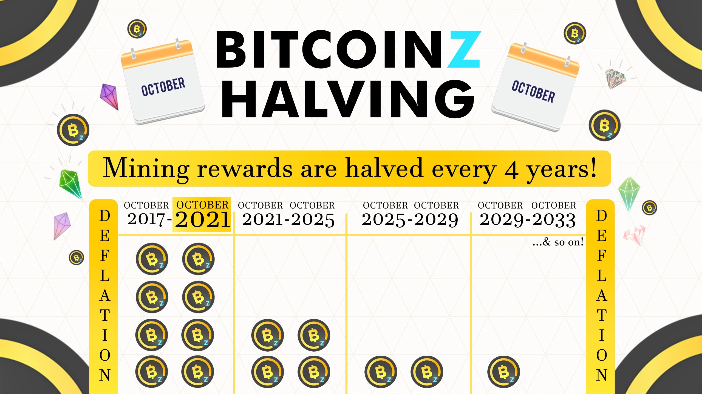
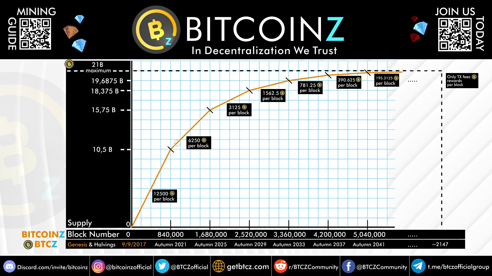
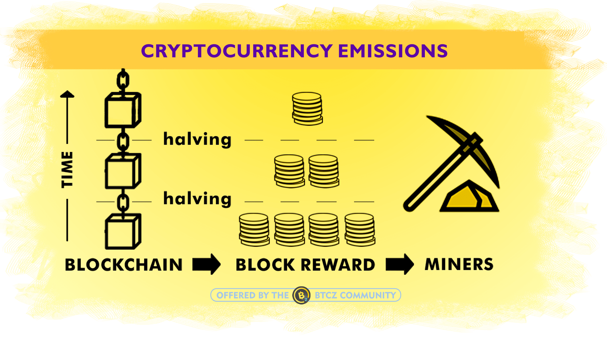
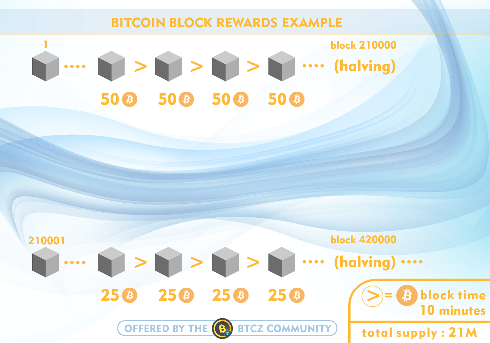
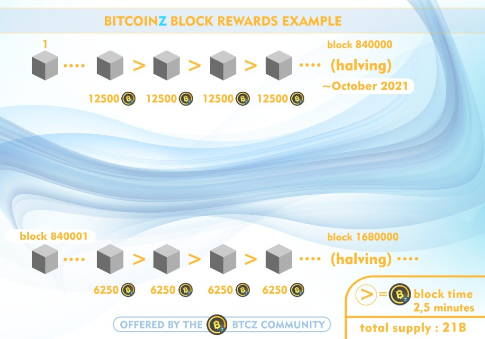
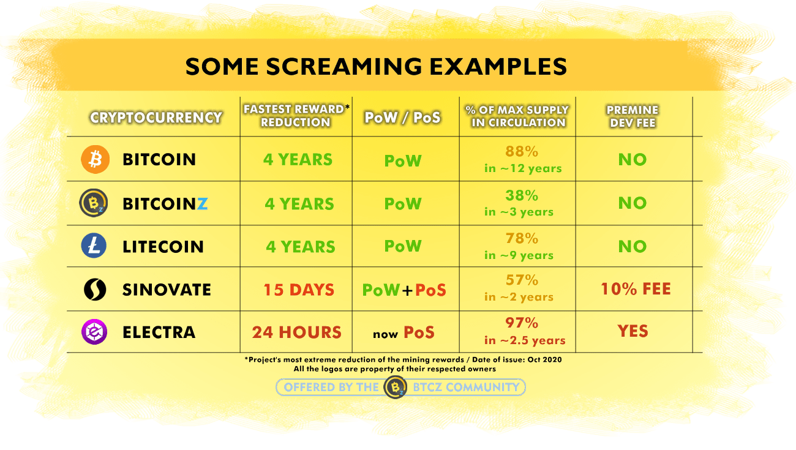

BITCOINZ is a deflationary cryptocurrency, with halvings on its mining rewards every 4 years.

It is the oldest and maybe the only "BITCOIN" named project that can still be mined with a normal PC and it is not a Bitcoin blockchain fork, as it had its own genesis block!

BITCOINZ was launched with the legendary "BITCOIN" name because it added optional privacy with its "Z" addresses, fixed the high Bitcoin fees reducing them almost to zero, offered scalability, protected the PC miners from the ASIC elites and at the same time it truly honoured Bitcoin's vision with:

- Fair launch with no premine or ICO sales
- Proof of Work model (it can be mined)
- No company structure as it is 100% Community Driven, with no central authority ever issuing & distributing coins.

Many times, cryptocurrency fans and newcomers hear the phrase "halving plan" or just "halving". We are using this word in order to describe the changes of the rewards of a minable digital coin (emission). These changes are included in a set of rules that every Project should always describe publicly in its announcement for the coin (white paper/ bitcointalk forum).

## What is the "emission rate"?

The **emission rate** is the programmed number of coins which the Project is distributing for every block as reward to the miners. This way, the programmed emissions are defining the circulating supply of the digital coins in the market, the inflation rate and their maximum supply.

Each PoW (proof of work) cryptocurrency project has different rules for the changes in their mining rewards through time.

But what is the meaning of a halving for the emissions rate? This is usually happens as **a hedge against inflation** over time. As the price, guided by price equilibrium, is bound to increase. On the flip side, fiat currencies (like the US dollar), inflate over time as its monetary supply increases, leading in reality to a decrease in purchasing power. This is known as monetary debasement by inflation and an example for this can be seen by just comparing the housing prices before some decades and today.

## The example of the Bitcoin's halving plan

For example, the legendary Bitcoin with 21 Million coins maximum supply, when was launched on May 2009 had a block reward of 50 BTC which is halved every 210 thousands of blocks or 4 years because each block has a time of 10 minutes.

So, 4 years later (May 2013) and after the block no210,000, the reward was 25 BTC for every block. In the same way, after 4 more years and on May 2017, at the block no420,000 and beyond, the block reward is halved again to 12.5 BTC. And so on.

## Another example: BitcoinZ's halving plan

In the same way, BitcoinZ has **a same halving pace** for its block rewards: **every 4 years**. It was launched in 2017 with 12,500 BTCZ coins as block reward with block time of 2,5 minutes.

4 years later, on Oct 2021, there are 6,250 BTCZ coins as reward, on Oct 2025 this is halved to 3125 coins and so on.

## The importance of a fair and slow halving plan

It is very important to understand the role of a well balanced halving plan for the block rewards of a digital coin. A digital coin with no halving plan would face inflation issues because the coin supply in the market would be endless. On the other hand a digital coin with ultra fast halvings in a few months is usually a speculative trick that has been made extremely popular among the various cryptocurrency scams.

## Fast and unbalanced halving plans: a high possibility scam

There have been cryptocurrency projects with their block rewards cut to half again and again in just a few weeks or even days! Under such circumstances, the miners who know about the project, and join immediately its network, are enjoying huge block rewards while any future miner is condemned to be rewarded with just a small fraction of the reward.

This leads to extreme centralization in the level of the digital coin distribution and this is something that goes against the original cryptocurrency idea.

Usually, the founders of projects with fast reward halvings are targeting to a massive sell-off. Since their easy to obtain holdings, during the first period with the great mining rewards, are the lion's share of the whole circulating supply.

This way, they can easily "pump" the price of their project with some tricks in order to technically increase the demand. So they sell their coins with the inflated prices before jumping to their next project that will be again under their full control and prepare their next scam exit.

This is why the really Community Driven Projects with fair coin distribution are always much more transparent and resistant to such scam scenarios. Simply because there is no governor or founders beneficiaries who technically own the lion's share of the coin supply.

